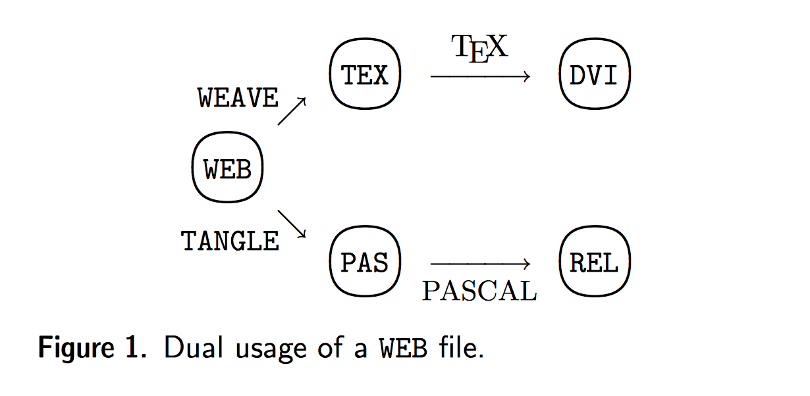

```{r include=FALSE}
library(knitr)
opts_chunk$set(echo = FALSE, comment = NA, root.dir = "../")
library("htmltools")
library("vembedr")
library(ggplot2)
library(plotly)
library(dplyr)
library(readxl)
csl <- "NEMJ"
```

# R 이란? {#LecttureEx}

## R의 탄생 {#Born}

- New York Times 기사: <http://www.nytimes.com/2009/01/07/technology/business-computing/07program.html?pagewanted=all&_r=0>

## R 소개 영상 {#WhatIsRA}

```{r}
embed_youtube(id = "TR2bHSJ_eck")
```

## R 인기도 {#Popularity}

- Tiobe Index: <http://www.tiobe.com/tiobe-index/>

## 연구와 R {#SearchInR}

- 통계학이 쓰이지 않는 연구??

- R은 전 세계 통계학자들의 공통 언어가 됨

- Nature: <http://www.nature.com/news/programming-tools-adventures-with-r-1.16609>


## 생물학과 R {#BiologyInR}

- R은 생물학 데이터 분석에서 중요한 위치를 차지

- Robert Gentleman: Bioconductor 프로젝트와 [23andMe](http://www.prnewswire.com/news-releases/bioinformatics-pioneer-robert-gentleman-phd-joins-23andme-leadership-team-300059876.html)

- 생물정보학에서 많이 쓰이는 언어: R, Python, Perl 

- Bioconductor.org: <https://www.bioconductor.org>

# 간단한 활용 사례 {#SimpleUsage}

## 엑셀에서 데이터를 가지고 와서  {#FromExcel}

```{r echo=TRUE}
car_df <- read_excel("xlsx/mtcars.xlsx")
rmarkdown::paged_table(car_df)
```

## 표로 정리하거나(dplyr 패키지)

```{r echo=TRUE}
result <- car_df %>% 
            group_by(cyl) %>% 
            summarize(Mean_MPG = mean(mpg, SD = sd(mpg)))
kable(result)
```

## 분석(모델링)하거나

```{r echo=TRUE}
anova(lm(mpg ~ wt + cyl, data = car_df))
```


## 정적인 그래프(ggplot2)를 그리거나

```{r echo=TRUE, out.width="65%"}
p <- ggplot(mtcars) + geom_point(aes(wt, mpg, color = factor(cyl)))
p
```

## 다이내믹 그래프(plotly)를 만들거나 {#Dynamc}

```{r echo=TRUE}
ggplotly(p)
```

## 커뮤니케이션한다. {#Commu}

- Dynamic & Reproducible Document Generation

    - 문서(워드, PDF, HTML)

    - 웹 페이지, 웹 북, 웹 애플리케이션 등으로 공유 

- Reproducible Research: 제가 쓴 책들의 주제  

    - yes24: <http://www.yes24.com/searchcorner/Search?keywordAd=&keyword=&domain=ALL&qdomain=%C0%FC%C3%BC&Wcode=001_005&query=%B0%ED%BC%AE%B9%FC>

- R Shiny: 다음 책의 주제 

    - 간단 예제

# 기초 지식 {#Introduction  data-background="https://cran.rstudio.com/Rlogo.svg" }


## 재현가능연구 방법이란? {#WhatIsRRR}

- 코드와 마크업 언어를 하나의 파일에 작성한 다음, 이것을 프로세싱하여 문서를 만드는 방법 

    - R 코드로 데이터 분석, 시각화 등을 처리 
    - 마크업 언어(주로는 Markdown으로)로 저자의 생각을 작성
    - 하나의 파일에 작성: 코드와 마크업 언어를 엮기(web) 또는 짜기(knit)
    - 프로세싱
        - 1 차: 코드를 처리
        - 2 차: 문서 렌더링
    - 문서: HTML, 워드(docx), PDF 포맷 --> 웹 사이트, 책, 대시보드 등의 복합물 제작


## 재현가능연구을 사용하는 이유 {#WhyRRR}

- **신뢰성** 있는 문서(논문, 보고서 등)를 작성할 수 있다. 

    - 데이터에서 최종 결과물까지 모든 것을 연결하여 작업할 수 있다.

- Copy & Paste 패러다임을 벗어나서 같은 작업을 반복하지 않으므로써 **효율적**으로 작업할 수 있다.

- 문서 작성 자체의 **재미**를 높인다. 


- 이번 발표는 이 방법이 지루하지 않고 재미있다고는 것을 설명하여 많은 분들이 이 방법을 사용하도록 유도하는 것을 목적으로 한다. 하지만 더 중요한 **과학적 재현성**에 대한 엄밀함을 추구할 필요에 대해서 내재되어 있다.


### Nature 誌: 과학의 재현성 위기에 대한 설문 

- <http://www.nature.com/news/1-500-scientists-lift-the-lid-on-reproducibility-1.19970>


## 재현가능연구 영상 {#Movices}

```{r}
embed_vimeo(id = "178485416")
```

- RStudio.com의 새로운 서비스 [RStudio Connect](https://www.rstudio.com/products/connect/) 출시


## 재현가능연구 방법이 중요한 이유 {#WhyIMportanct}

- 문서 = 데이터(R로 처리) + 텍스트(마크다운으로 처리)

- 연구 논문 등을 작성할 때
    
    - 데이터에서 논문까지 다이내믹하게 연결하여 작업하면 논문의 신뢰성과 효율성이 높아진다.
    
- 실용적인 목적으로 다양하게 활용
    
    - 워드문서, PDF 문서, web 문서를 다양한 포맷을 하나의 소스로 작성할 수 있다. 
    
    - 웹 페이지, 웹 북, 블로그 등 다양한 것들을 만들 수 있다.

  
## 재현가능연구 방법론의 발전 {#History} 


- Donald Knuth의 Literate programming이라는 개념에서 시작 
    - 컴퓨터: 코드
    - 사람: 텍스트

```{r}

```

- 당시 PASCAL + TeX


## R에서의 재현가능연구 

- Sweave

    - F. Leisch(2002), S 언어 + LaTeX

- knitr
    - Yihui Xie(2011-2012), R + LaTeX

    - Sweave 한계를 넘고 필요한 기능들을 추가함

- knitr + rmarkdown + pandoc + RStudio

    - 재현가능연구 방법에 대한 완벽한 플랫폼 제공
    
    - Any Language / Any Markup Language 조합으로 발전 중
    
    - 종이 중심의 문서를 넘어 웹 콘텐츠 생산까지 가능 


##  재현가능방법 사용의 예  {#plolty}

- htmlwidgets로 만들어진 `ploty` 패키지(<https://plot.ly/r/>)로 인터랙티브 플롯 생성하고, `revealjs` 패키지를 사용하여 .Rmd 파일에 넣어서 렌더링하였다.

```{r, echo=FALSE, fig.align='center'}
p <- ggplot(data = diamonds, aes(x = cut, fill = clarity)) +
            geom_bar(position = "dodge")
ggplotly(p)
```

## 다이내믹 콘텐츠 {#Dynamic}

- htmlwidgets 패키지
    - 자바스크립트 라이브러리들에 대한 R 바인딩 패키지
    - R 콘솔, Shiny 앱, Rmd 문서에 마치 플롯 함수처럼 사용할 수 있도록 

```{r }
include_url("http://gallery.htmlwidgets.org")
```

## Rmd 파일에 Shiny App 가지고 오기 {#ShinyApp}

- `knitr::include_url()` 함수 

```{r}
include_url("https://shiny.rstudio.com/gallery/submitbutton-demo.html")
```


## 포맷은 다르지만 원리는 하나 {#BasicWorkflo}

```{r out.width="85%", fig.align='center'}

```

## 툴들의 핵심 역할 {#Roles}

- knitr
    - 소스파일에서 코드를 인식하고, 이것을 실행하고, 결과를 주변의 마크업 언어와 맞게 배치

- pandoc

    - 팬독 마크다운 문법 & 유니버셜 문서 변환기

- rmarkdown

    - `pandoc`에 대한 wrapper
    - 문서 포맷별 문서 렌더링 
    
- RStudio IDE

    - 재현가능연구 플랫폼 제공: 편리한 GUI 등

## 재현가능연구 방법을 위한 RStudio 설정 {#RStudio}

- 윈도우에서는 텍스트 인코딩을 `UTF-8`으로 지정 

- 프로젝트 기능의 적극적인 활용

- 폴딩, 개요 보기, 찾기/바꾸기, Knit 버튼, 깃, 빌드 기능 

- Viewer pane

- Pandoc 바이너리가 내장 

## 참고할 rmarkdown 사이트 {#MajorSitesRmarkdown}

```{r}
include_url("http://rmarkdown.rstudio.com", height = "500px")
```

## 참고할 knitr 사이트{#MajorSiteKnitr}

```{r}
include_url("http://yihui.name/knitr/", height = "500px" )
```


# Rmd 소스파일 {#RmdSource data-background="https://cran.rstudio.com/Rlogo.svg" }

## Rmd = R + markdown {#WhatIsRMD}

- Rmd 파일은 R 코드와 마크다운은 섞어 놓은 것

    - YAML 헤더, 코드 청크, 마크다운 

```{r out.width="35%"}

```

## 코드 청크 {#codeChunks}

- 블록 코드 청크, 인라인 코드 청크로 구분

    - knitr는 주로 이것을 관리

```{r}

```

## 1차 컴파일 후 md 파일로 {#AfterFirst}


- Rmd 파일 1차 컴파일을 마치면 마크다운 파일로 변환(확장자 .md)

- 일반 마크다운 파일이 아닌 팬독 마크다운 파일임

    - 이 팬독 마크다운 파일을 pandoc이 원하는 포맷으로 렌더링함 

- 전체 과정을 rmarkdown 패키지가 조정

## rmarkdown 패키지의 역할 {#Rmarkdown}

- rmarkdown은 pandoc에 대한 wrapper이다. 

    - 다음과 같은 복잡한 명령을 대신 해 준다.

- rmardkown의 기능은 YAML 헤더와 관련이 깊다.

```{r}
include_graphics("../images/pandoc.png")
```

## YAML 헤더와 rmarkdown {#YAML}

- 문서 처음에 `---`와 `---` 사이에 문서에 대한 사항을 명시한다.


        ---
        title: "연습장"
        author: "SBKo"
        output: 
          html_document:
            toc: true
        ---

- YAML 문법에 맞게 작성

- 사용가능한 필드와 값은 `rmarkdown` 패키지의 도움말을 참고한다.

        help(html_document)

- YAML 헤더의 내용은 해당 출력 함수로 전달되고, 이것은 궁극적으로 pandoc으로 전달된다


## YAML 문법 {#YAMLSyntax}

- R 재현가능연구 방법을 사용할 때 반드시 알고 있어야

    - `필드: 값`의 형태로 지정 
    
    - 위계는 들여쓰기로 정해지기 때문에, 들여쓰기에 신경을 써야 한다.
    
    - 복수의 값을 전달할 때는 `-`로 시작하는 새로운 행, 또는 `[]` 안에 나열
    
    - 별도의 파일로 작성될 때 `.yml`이라는 확장자를 쓴다. 예) `_output.yml`
    

- 참고: knitr/rmakrdown/pandoc을 사용한 재현가능연구에서 `_`로 시작되는 파일을 기본적으로 렌더링하지 않게 설정하고 있어서, 뒤에서 복합 문서를 만들 때 설정 파일을 만들 때 사용한다. 
    


## YAML에 대한 Wiki 사이트 {#YAMLWiki}


```{r}
include_url("https://en.wikipedia.org/wiki/YAML")
```

    

## 코드의 실행 {#CodeEvaluation}

- 하나의 Rmd 파일에는 여러 개의 청크가 사용된다.

- 이들 청크들은 하나의 R 세션에서 실행된다.

    - 앞에 청크에서 정의된 변수는 이후의 청크에서 사용 가능하다.
    - R이 아닌 다른 언어를 사용하는 경우에는 청크들은 그 환경을 공유하지 않는다.
    
- 워킹 디렉터리는 `.Rmd` 소스파일이 있는 디렉터리가 된다. 

    - `opts_knit$set(root.dir = ...)` 패키지 옵션으로 변경이 가능하다. 
    - 가급적 디폴트 사용이 권고되고, 어느 정도 알고 난 이후에 이 방법을 시도해 보는 것이 좋다.
    

## 글로벌 청크 옵션을 지정하는 방법 {#GlobalChunkOptions}

    
- 개별 청크별로 옵션을 따로 지정하여 사용하는 것보다, 우선 전체 청크에 적용되는 글로벌 설정을 하고, 필요한 경우 이것을 override 하는 방법을 사용한다. **Global Setting, Local Override!**

    - 첫 번째 청크는 이런 목적에 사용한다.
    - 이 청크는 보통 `include=FALSE`, `echo=FALSE`를 가진다. 의미?
    - 주로 패키지 로딩, 글로벌 청크 옵션 등을 설정
    
            opts_chunk$set() 안에 청크 옵션들을 지정
            
    - 나중에 개별 청크에서 옵션을 새로 지정하면 글로벌 설정이 override 된다.

## 글로벌 청크 옵션 사용 예 {#ExGlobalSEtting}

```{r}

```


# 문서 렌더링 프로세스 {#DocumentRendering  data-background="https://cran.rstudio.com/Rlogo.svg" }

## Rmd 파일의 1차 컴파일(transpilation) {#FirstCompile}

- 주로 니터(knitr) 패키지에 의해서 주도
    - 코드를 인식, 코드의 실행, 결과를 주변 텍스트에 맞추는 일을 한다. 
    
- 전체 과정에서 코드를 인식하고 실행하는 과정이 가장 먼저 실행된다는 사실을 이해하는 것이 중요 

- 코드 청크를 경계를 포함하여 verbatim으로 표현하는 것은 생각보다 쉽지 않음

    - 관련된 내용은 <http://rmarkdown.rstudio.com/articles_verbatim.html> 등을 참고하는 것을 권고
    

## YAML 헤더, rmarkdown::render(), 팬독 {#YAMLheaderRender}

- YAML 헤더는 문서의 포맷 등을 정하는 중요한 역할을 한다. 

    - 특히 `output: ` 필드가 중요
    
            output: html_document
            
- 이 정보들은 rmarkdown 패키지에 있는 `render()` 함수를 전달된다. `output: html_document`를 사용하는 경우 이 정보들은 `html_document()`로 전달되고, 이것이 `render()` 함수에서 사용된다.

- 궁극적으로 pandoc의 `pandoc` 문서 변환기에 전달된다. 
      
## YAML 헤더 작성법 {#YAMLheaderWriting}

- 팬독의 템플릿과 rmarkdown 패키지의 함수에서 정해진 옵션을 지정하는 일이다. 

- YAML 헤더를 작성하는 실제 예이다. 들여쓰기로 위계를 정한다는 것이 중요하다.

        ---
        title: "재현가능연구의 실제"
        author: "SBko"
        date: "`r Sys.Date()`"
        output:
          html_document:
            toc: true
            theme: flatly
        ---
        
- 이 필드중에서 `title`, `author`, `date`는 팬독 플릿에서 정의되는 것들이고, `output` 필드는 `rmarkdown` 패키지에서 정의되는 것들이다.


##  YAML 헤더를 위한 정보 {#InformationYAML}

- 팬독: <http://pandoc.org/MANUAL.html#variables-set-by-pandoc>를 참고한다. 문서 포맷에 따라서 사용되는 필드들이 조금씩 다를 수 있는데 `title`, `subtitle`, `author`, `date` 만 알아도 무방하다.

    - 팬독에서 설정된 필드들을 대부분 최상위에

- rmarkdown 패키지의 문서 포맷 함수들에 대한 정보: 도움말 페이지를 참고한다. 이를테면 `output: html_document`를 사용하는 경우에는 다음 내용을 보고, 이것을 YAML로 표현하면 된다.

    - rmarkdown에서 설정되는 필드들을 대부분 `output:` 필드의 하위 필드로

## YAML 헤더 필드: 팬독에서 정의된 것 {#YAMLHeaderFields}

    ---
    title: "R 재현가능연구 방법으로 다이내믹 문서 만들기"
    author: "(주)지노바이오 고석범"
    bibliography: "refs/rrwithr.bib"
    csl: "refs/the-new-england-journal-of-medicine.csl"
    output: 
      html_document: 
        toc: true
    ---


```{r}
include_url("http://pandoc.org/MANUAL.html#variables-set-by-pandoc")
```

## YAML 헤더 필드: rmarkdown에서 정의된 것 {#YAMLrmarkdown}

    ---
    title: "R 재현가능연구 방법으로 다이내믹 문서 만들기"
    author: "(주)지노바이오 고석범"
    bibliography: "refs/rrwithr.bib"
    csl: "refs/the-new-england-journal-of-medicine.csl"
    output: 
      html_document: 
        toc: true
    ---

```{r eval=FALSE, echo=TRUE}
?html_document
```


```{r}
formatR::usage("html_document")
```


## rmarkdown 패키지 이외의 문서 포맷을 사용하는 경우 {#Others}

- `rmarkdown` 패키지 이외에는 문서 포맷을 지원하는 다양한 패키지들이 (많이) 나와 있다. 대표적인 것으로 다음과 같은 것들이 있다.

    - `revealjs`: 이 슬라이드는 이 패키지를 사용하여 만들었다. 
    
    - `tufte`: 데이터 시각화의 선구자로 알려진 E. Tufte의 책과 핸드아웃에 디자인 
 
 
- 이런 경우에는 다음과 같이 네임스페이스 연산자(`::`)를 사용하여 표현한다.

        output: 
          revealjs::revealjs_presentation:
            theme: sky


# 팬독 마크다운 {#PandocMarkdown data-background="http://pandoc.org/diagram.jpg" }

## 팬독 마크다운 {#PandocMarkdownSyntax}

- 일반적인 마크다운의 확장: RStudio 메뉴 `Help | Markdown Quick Rerference` 참고

- 팬독 마크다운 문법: 
    
    - rmarkdown 사이트: <http://rmarkdown.rstudio.com/authoring_pandoc_markdown.html>

    - 주석 달기, 위/아래 첨자, 참고문헌 등 팬독 마크다운만으로 충분히 일반 논문 작성이 가능하다.

## 팬독 마크다운: 클래스와 아이디 {#classID data-background=#ede89c}

- 이 슬라이드의 제목을 아래와 같이 했다. 

        ## 팬독 마크다운: 클래스와 아이디 {#classID}

- 커스텀 스타일 혹은 이미 정해진 스타일, 목차 등을 만들 때 필요하다.

- 특히 한글을 포함한 CJK를 사용하는 경우 영문으로 아이디를 지정하지 않으면 목차 링크가 제대로 만들어지지 않는다(제목에 쓰인 텍스트를 가지고 아이디를 내부에서 만드는 과정에서 CJK가 제대로 처리되지 않으면서 문제 발생)

## 팬독 마크다운: 참고 문헌 {#citationsInsert}

- YAML 헤더에 `bibliography:` 필드에 참고문헌 데이터 파일을 지정
- YAML 헤더의 `csl:` 필드로 참고 문헌 포맷을 지정(<https://github.com/citation-style-language/>에서 다운로드 가능함)

        ---
        bibliography: "refs/rrwithr.bib"
        csl: "refs/nature.csl"
        ---
        
        ...본문에서

        김 등이 발표한 논문[@doi:10.1021/acs.analchem.6b03534]에 의하면 

- 실제 렌더링 

    김 등이 발표한 논문[@doi:10.1021/acs.analchem.6b03534]에 의하면 

- 인용된 논문은 문서의 마지막에 자동으로 렌더링

## 팬독 마크다운: 수식 {#Math}


- 인라인 수식은 `$`로 둘러싸서 LaTeX Math로 기술한다.

    - 비율은 $proportion=\frac{a}{a+b}$로 표시

- 블록 수식은 `$$`로 둘러싸서 LaTeX Math로 시술한다.

    $$
    \bar{X} = \frac{\sum_{i=1}^{n} X_i}{n}
    $$


    ~~~
    비율은 $proportion=\frac{a}{a+b}$로 표시
    
    $$
    \bar{X} = \frac{\sum_{i=1}^{n} X_i}{n}
    $$
    ~~~


## 표(table) {#Tables}

- 재현가능연구에서 가장 까다로운 부분으로 여러 패키지를 적절한 상황에서 선택 

    - ztable, knitr::kable(), rmarkdown::paged_table(), xtable, pander, tables  등 다양함 

    - 팬독 마크다운으로 출력된다면 출력 포맷에 상관없이 사용가능 
    
    - 팬독 마크다운이 아닌 마크업으로 출력되는 경우 필요한 옵션들을 출력에 맞추는 과정이 필요함 
    
    - 경우에 따라서 `results="asis"` 청크 옵션이 필요한데, 다음 예는 `tables` 패키지를 사용한 예이다.

```{r message=FALSE, results='asis'}
library(tables)
tab <- tabular((Species + 1) ~ (n=1) + Format(digits=2)* (Sepal.Length + Sepal.Width)*(mean + sd), data=iris )
html(tab)
```


# 니터 패키지: 이해가 필요가 청크 옵션 {#Knitr data-background="http://yihui.name/knitr/images/knit-logo.png" }


## 니터 패키지의 역할 {#RoleOfKnitr}


```{r}

```

1. 코드를 인식한다. 

1. 코드를 실행한다.

1. 결과를 주변에 맞춘다.

## 니터 패키지의 옵션과 객체 {#KnitrOptionsObjects}

- 니터은 *패키지 옵션*과 *청크 옵션*을 가지고 있다.

    1. 패키지 옵션
    
        - `opts_knit`에 저장하고 관리, `get()`, `set()` 메서드
    
    1. 청크 옵션
    
        - `opts_chunk`에 저장하고 관리, `get()`, `set()` 메서드
    

## 코드 청크의 6대 결과물 {#MajorSix}

- 코드 청크 출력물의 종류는 6 가지로 구분할 수 있다. 청크 옵션들은 이 6대 출력물 별로 이해하면 좋다(<http://yihui.name/knitr/options/>).

- 어떤 청크 옵션들을 타깃 문서와 관련되어 있다.

```{r}
contents <- c("code", "text", "image", "message", "warning", "error")
examples <- c("코드 청크에 있는 R 코드",
              "summary(iris)의 출력물",
              "plot(iris)의 결과물",
              "메시지",
              "경고",
              "에러"
)
df <- data.frame(contents, examples)
kable(df, align = "l", caption = "코드 청크 6대 출력물")
```


## 코드와 관련된 청크 옵션 {#HandlingCode}

    ```{r eval=TRUE}`r ''`
    n <- 10
    rnorm(n)
    ```
- 이것은 다음과 같이 렌더링된다.

    ```{r eval=TRUE, echo=TRUE}
    n <- 10
    rnorm(n)
    ```

- eval: 코드를 평가(실행)할지 결정, `TRUE/FALSE`, 숫자형 벡터, 디폴트는 TRUE이다. 
    - `opts_chunk$get()[["eval"]]`

## 텍스트 처리와 관련된 청크 옵션 {#TextManipuation}

- 텍스트로 출력되는 결과물

    - warning, error, message과 같이 코드가 평가되면서 출력되는 텍스트 
    - R 코드 자체: 
    - `summary(iris)`와 같은 결과물
    - HTML, LaTeX과 같은 마크업 등으로 출력되는 결과물

## HTML, LaTeX 같은 마크업 {#MarkupResults}

- 표(table)을 렌더링하기 위한 패키지들을 사용할 때 흔히 접하는 문제
    - `ztable`, `xtable`, `tables` 같은 패키지들 

- `reults` 청크 옵션

    - `markup`: 사용되는 마크업에 맞게 출력
    - `asis`: 있는 그대로 사용한다. 즉 1차 컴파일에서는 처리하지 않고 2차 컴파일에서 표 등으로 렌더링되게 한다. 꼭 사용해야 하는 경우들이 있다. 
    - `knitr::kable()` 함수 등은 자동으로 이것을 처리(디폴트 출력이 팬독 마크다운이기 때문)
    
## error 청크 옵션 {#errorOption}

- 에러의 처리에 대한 옵션: `TRUE` 또는 `FALSE`

- 문헌상에서는 디폴트 값이 `TRUE`로 되어 설정되어 있다. 약간의 차이가 있다.

    - 이 옵션을 사용하지 않고 그 디폴트를 사용하는 것
    - `error=TRUE`을 지정하는 것 

- 지정하지 않은 경우 코드에 에러가 있으면 더이상 렌더링 되지 않음 
- 지정한 경우 코드에 에러가 있으면 그 에러 메시지가 표시되면서 렌더링 됨

## 이미지 처리에 관련된 옵션 {#Images}

- 이미지 처리 과정을 전반에 대하여 조절할 수 있다.

    - 니터는 다양한 그래픽 디바이스을 지원한다(`dev` 옵션).

    - 하나의 코드에서 여러 장의 그래픽을 출력할 수 있다(`fig.show` 옵션)
    
    - 이미지의 크기는 그래픽 디바이스의 크기(`fig.width, fig.height`) 또는 출력물을 대한 상대 크기(`out.width, `out.height`)로 정할 수 있다.
    
    - ... 이미지 처리와 관련된 청크 옵션이 가장 많다.

## 한글이 들어간 이미지: showtext 패키지의 사용 {#showtext}

- `fig.showtext=TRUE, warning=FALSE, message=FALSE`

```{r fig.showtext=TRUE, echo=TRUE, warning=FALSE, message=FALSE, out.width="50%"}
library(showtext, quietly = TRUE)
font.add("myFont",  "NanumPen.otf")
hist(rnorm(1000), main="한글 제목이 들어간 그래프", family="myFont")
```


## 한글이 들어간 이미지: showtext 패키지의 사용(ggplot2) {#showtextggplot2}

```{r fig.showtext=TRUE, out.width="50%", echo=TRUE}
ggplot(mtcars, aes(wt, mpg)) + 
  geom_point() + 
  labs(title="한글이 들어간 그래프") +
  theme(plot.title=element_text(family="myFont", size=20, hjust=0.5))
```


## 코드 생성하는 이미지가 아닌 외부 이미지 처리 {#IncludeGraphics}

- 니터 패키지의 `include_graphics()` 함수를 사용

- 표준 마크다운에는 이미지 크기를 조절하는 문법이 존재하지 않고, 팬독 마크다운에도 매우 한정되어 있어서 이 함수를 사용하는 것이 매우 편리함 

- 참고: `include_url`은 웹 페이지를 가지고 오고, `include_app()`은 샤이니 앱을 가지고 올 수 있다.

## 청크,코드를 다이내믹하게 활용 가능  {#performance}

- 코드 외부화

- 코드의 조건부 실행

- `code` 청크 옵션을 통해서 다이내믹하게 청크 코드 삽입할 수 있음 

- 다른 청크의 코드를 가져와 재사용 가능 

- 훅(Hooks) 함수를 지정하여 코드의 실행 전, 후에 필요한 내용을 삽입할 수 있음

- YAML 헤더에 `params`라는 필드를 사용하여 파라미터화된 문서 생산 가능

    - 하나의 소스파일로 부서별, 분기별 보고서를 다르게 생산할 수 있음


# rmarkdown 패키지: 다양한 문서 포맷 {#Formats  data-background="../images/rmarkdown.png"}

## rmarkdown 출력 포맷 함수들 {#OuputFormatFunctions}


- rmarkdown 패키지에 내장된 주요 출력 포맷 함수들(더 있다)

    - 'html_notebook()`

    - `html_document()`

    - `pdf_document()`

    - `word_document()`

- 이것들은 YAML 헤더의 `output` 필드와 깊게 관련되어 있다.

- 가장 중심은 `html_document()`이다.

- `pdf_document()`를 사용하기 위해서는 LaTeX이 설치되어 있어야 한다.

## 일반적으로 html_notebook으로 문서 작성을 시작 {#HowToReport}

- 파이썬의 주피터 노트북(<http://jupyter.org>)과 비슷한 기능을 RStudio에서 구현한 것

- 인터랙티브 데이터 분석 과정에 최적화

    - 레이텍 수식의 결과도 바로 렌더링
    
    - 플롯이나 외부 이미지도 바로 보여줌 


## 그 다음 html_document로 작업 {#HTMLdocument}

- YAML의 `output:` 필드에는 여러 개의 출력 포맷을 지정할 수 있는데, 가장 앞에 오는 것이 사용된다. 

- `pdf_document`, `word_document`는 기본적으로 렌더링이 느리다. `html_doument`로 모두 작업하고 이들 포맷으로 넘어가는 것이 좋다. 

- `html_document`의 옵션을 기본으로 하는 다른 포맷 함수들이 있기 때문에 이 포맷 사용법을 이해하면 다른 것을 이해하기 편리하다.

## html_document에서의 스타일 {#Styles}

- [부트스트랩](http://getbootstrap.com) 3.3.5 버전을 사용하고 있음 

- YAML 헤더 필드 `self-contained: no` 를 사용하면 이들을 따로 분리해서 확인할 수 있다. 

- YAML 헤더에 `css: myStyle.css`를 사용하여 커스텀 스타일을 추가할 수 있다. 

- 완전한 사용자 스타일을 사용하려면(디폴트로 사용되는 것을 완전히 배제) `theme: null`을 주고 `css: Custom.css`를 추가한다. 


## 자동 렌더링/서빙 {#AutomaticRendering}

- 내용을 입력하면서 그 내용이 바로 컴파일되어 자동으로 결과를 확인할 수 있게 하면 작업이 편리해진다.

- RStudio 통합개발환경의 Viewer 창은 일종의 브라우저이다.

- `servr` 패키지(knitr 개발자인 Yihui Xie가 개발함)

    - rmdv2(), httd(), httw() 적절히 사용
        - rmdv2(): 렌더링 + 서빙 
        - http(): 서빙
        - httw(): 와칭 + 서빙

- 결과물은 Viewer를 통해서 볼 수 있다.

## pdf_document()로 PDF 문서 생산 {#PDFs}

- PDF는 레이텍(LaTeX)을 사용하여 만들기 때문에 레이텍이 컴퓨터에 설치되어 있어야 한다.

    - 원도우: MikTeX
    - 맥: MacTeX

- Raw LaTeX을 사용하지 않아도 웬만한 작업이 가능

    - 이전: .Rnw --> .tex --> PDF
    - 현재: .Rmd --> .md --> .tex --> PDF

- 주요 서브 필드: `latex_engine: xelatex` (디폴트는 pdflatex)

## pdf_document() 프리앰블 작성 {#Preamble}

- 프리앰블을 이를테면 `preamble.tex`라는 파일에 저장한다.

- 이것을 `includes`의 서브 필드 `in_header`에서 부른다. 

        title: PDF 문서 만들기
        author: SBKo
        output: 
          pdf_document:
            latex_engine: xelatex
            includes:
              in_header: preamble.tex
              
- `preamble.tex`의 내용은 다음과 같은 것들이다.

        \usepackage{kotex}
        \setmainfont{NanumGothic}
        \setmainhangulfont{NanumGothic}


## 프리앰블을 작성하는 다른 방법 {#Preamble2}

- 다음과 같이 `header-includes: ` 필드를 사용하여 내용을 바로 입력할 수도 있다. 

        ---
        title: "Untitled"
        output: 
          pdf_document:
            latex_engine: xelatex
            toc: true
        header-includes:
          - \usepackage{kotex}
          - \setmainfont{NanumGothic}
          - \setmainhangulfont{NanumGothic}
        ---

- **주의**: pdf_document의 하위 필드가 아닌 가장 상위의 필드로 지정되었다는 점을 주의한다.

## word_document() 사용하는 경우 {#WordDocument}

- 사용할 수 있는 YAML 필드는 그렇게 많지 않지만, 그래도 꽤 쓸만하다. 

- 표를 제외하고는 대부분 제대로 렌더링된다. 제대로 만들려면 `knitr:kable()` 사용 

- `reference_docx:`를 사용하여 사용자 정의 스타일을 적용한 워드 문서를 만들 수 있다. 

- `webshot` 패키지(phantomjs와 함께)가 설치되어 있는 경우에는 다이내믹 콘텐츠는 스크린샷을 통해서 내용이 들어가게 한다.

# RStudio {#RsTduio data-background=#5CAFE6}

## RStudio: 재현가능연구 최적 플랫폼으로 진화 {#RStudioIDE}

- 프로젝트, 오버뷰 기능, 깃(Git), Packrat, Build 기능 등

- 한글 입력의 문제
  
    - 원도우에서 자주 발견
    
    - 나의 경우에는 atom 텍스트 에디터(<https://atom.io>)와 함께 사용(깃허브 회사에게 제작한 무료)
  


# 복합 문서 {#WebSitesBooks data-background="../images/bookdown.png"}

## 정적인 웹사이트 만들기 {#WebSites}

- 기본 파일: `index.Rmd`, `_site.yml`, `_output.yml` 파일

- `_site.yml` 파일의 예

        name: "my-website"
        navbar:
          title: "My Website"
          left:
            - text: "Home"
              href: index.html
            - text: "About"
              href: about.html

- 자세한 내용은 <http://rmarkdown.rstudio.com/rmarkdown_websites.html> 참고

## 블로그 엔진으로 사용 {#BlogEngine}

- `blogdown` 패키지

    - <https://github.com/rstudio/blogdown>

- 지킬

    - <https://github.com/yihui/knitr-jekyll>, <https://github.com/hadley/adv-r>

## bookdown 패키지로 깃북 만들기 {#bookdown}

- bookdown 패키지로 만든 bookdown 패키지 설명서: <https://bookdown.org/yihui/bookdown/>

## flexdashboard 패키지로 대시보드 만들기 {#Dashboard}

- flexdashboard: <http://rmarkdown.rstudio.com/flexdashboard/index.html>

## 참고문헌의 표시 예: `r csl` CSL  {#REfes}

